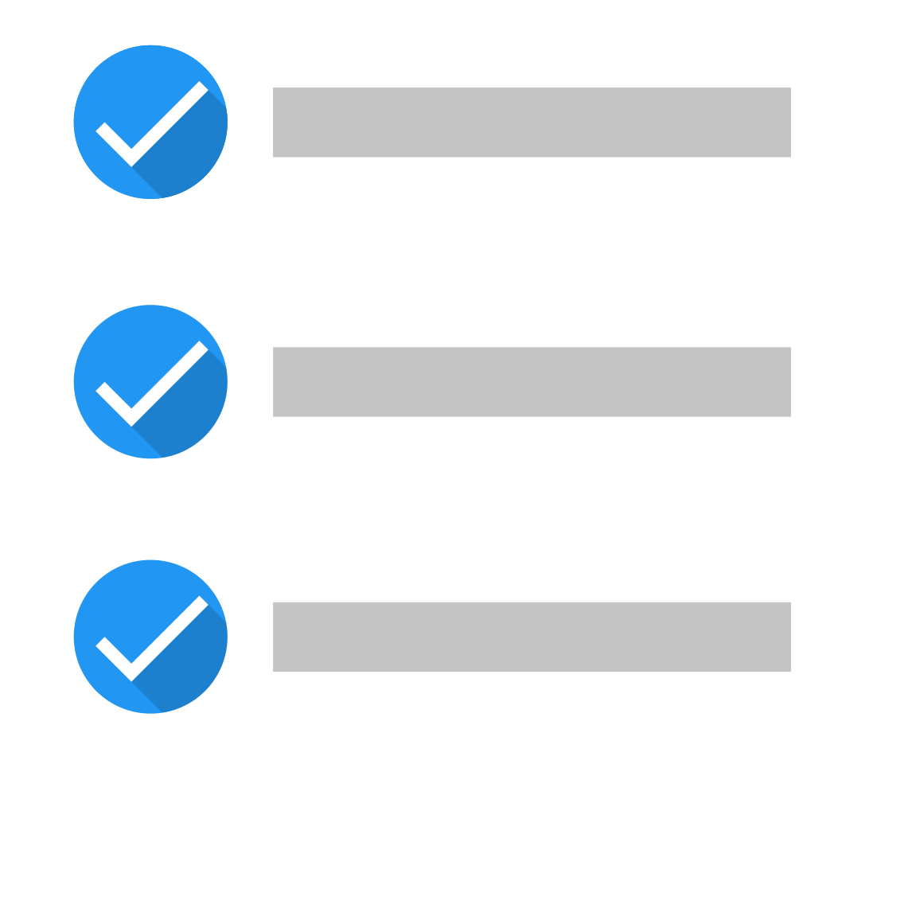

# Tasks.mac

An open-source macOS to-do application that synchronises with CalDAV servers (Nextcloud in particular) and is compatible with the [Tasks.org](https://tasks.org) Android app. The UI follows the macOS Reminders app design.

Key features:

- CalDAV synchronisation with Nextcloud
- Subtasks, recurrence, and other Tasks.org-compatible fields
- Synchronisation status always visible
- Explicit, scheduled, and push synchronisation
- Conflict resolution

## Requirements

- macOS 13 or later
- Swift 6 toolchain
- Python 3 (for the fake CalDAV server used in tests)
- [swiftlint](https://github.com/realm/SwiftLint) (for linting)

## Setup

Clone the repository and install the Python test dependencies:

```sh
git clone <repo-url>
cd Tasks.mac
make fake-caldav-deps
```

The Swift package dependencies are resolved automatically by the build system.

## Building

```sh
make
```

The application bundle is placed in the `build/` directory.

## Testing

```sh
make test       # acceptance and unit tests
```

## Linting

```sh
make lint
```
